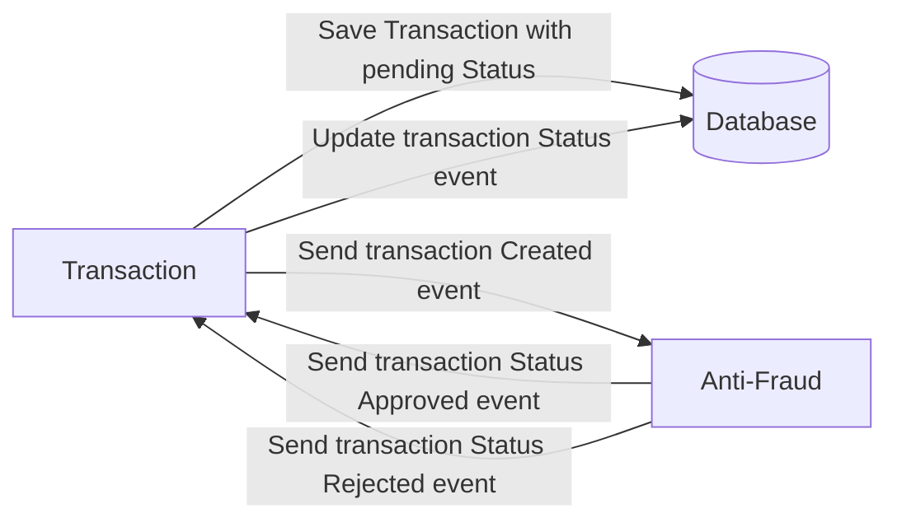

# Yape Code Challenge :rocket:

Our code challenge will let you marvel us with your Jedi coding skills :smile:. 

Don't forget that the proper way to submit your work is to fork the repo and create a PR :wink: ... have fun !!

- [Problem](#problem)
- [Tech Stack](#tech_stack)
- [Send us your challenge](#send_us_your_challenge)

# Problem

Every time a financial transaction is created it must be validated by our anti-fraud microservice and then the same service sends a message back to update the transaction status.
For now, we have only three transaction statuses:

<ol>
  <li>pending</li>
  <li>approved</li>
  <li>rejected</li>  
</ol>

Every transaction with a value greater than 1000 should be rejected.



# Tech Stack

<ol>
  <li>Node. You can use any framework you want (i.e. Nestjs with an ORM like TypeOrm or Prisma) </li>
  <li>Any database</li>
  <li>Kafka</li>    
</ol>

We do provide a `Dockerfile` to help you get started with a dev environment.

You must have two resources:

1. Resource to create a transaction that must containt:

```json
{
  "accountExternalIdDebit": "Guid",
  "accountExternalIdCredit": "Guid",
  "tranferTypeId": 1,
  "value": 120
}
```

2. Resource to retrieve a transaction

```json
{
  "transactionExternalId": "Guid",
  "transactionType": {
    "name": ""
  },
  "transactionStatus": {
    "name": ""
  },
  "value": 120,
  "createdAt": "Date"
}
```

## Optional

You can use any approach to store transaction data but you should consider that we may deal with high volume scenarios where we have a huge amount of writes and reads for the same data at the same time. How would you tackle this requirement?

You can use Graphql;

# Send us your challenge

When you finish your challenge, after forking a repository, you **must** open a pull request to our repository. There are no limitations to the implementation, you can follow the programming paradigm, modularization, and style that you feel is the most appropriate solution.

If you have any questions, please let us know.


# 📄 Transaction Service - Code Challenge Documentation

## 🧠 Overview

This service is part of the **Yape Code Challenge** and is responsible for handling financial transactions, including validation by an anti-fraud service via Kafka. The project consists of two microservices:

1. **Transactions Service**: Manages transaction creation, persistence and querying via REST/GraphQL.
2. **Antifraud Service**: Listens for transaction events via Kafka, validates them, and returns a status update.

---

## 🚀 Tech Stack

* **Node.js** with **NestJS**
* **GraphQL** with Apollo Driver
* **Kafka** for event-driven validation
* **PostgreSQL** via Prisma ORM
* **Docker** for containerized development

---

## 🔁 Transaction Lifecycle

1. A transaction is created via REST or GraphQL.
2. It is stored in PostgreSQL with `status: pending`.
3. The service emits a Kafka event `transaction_created`.
4. The **Antifraud Microservice** consumes the event and determines if:

   * `value > 1000` → `rejected`
   * otherwise → `approved`
5. Antifraud emits the result back via topic `transactions-validated`.
6. The **Transactions Service** listens and updates the transaction status in the database.

---

## 🛠 Key Modules

### 📦 `TransactionsService`

Handles business logic for transaction creation, retrieval and update.

```ts
createTransaction(dto: CreateTransactionDto): Promise<Transaction>
findOne(id: string): Promise<Transaction | null>
updateStatus(transactionId: string, status: string): Promise<void>
```

### 📡 Kafka Integration

* **Producer** emits `transaction_created` event.
* **Consumer** listens to `transactions-validated`.

### 📊 GraphQL Support

* Mutation: `createTransaction(input: CreateTransactionInput)`
* Query: `getTransaction(transactionExternalId: ID)`

---

## 🧪 Testing

### ✅ Unit Tests

* Services (`transactions.service.spec.ts`):

  * Create transaction
  * Handle DB errors
  * Kafka emission verification
* GraphQL Resolvers (`transaction.resolver.spec.ts`):

  * Mutation and query resolution

### 🧪 GraphQL Query Example

```graphql
mutation {
  createTransaction(input: {
    accountExternalIdDebit: "uuid-1",
    accountExternalIdCredit: "uuid-2",
    transferTypeId: 1,
    value: 500
  }) {
    transactionExternalId
    value
    status
    createdAt
  }
}
```

---

## ⚙️ Configuration

Kafka client config moved to `.env`:

```
KAFKA_BROKER=localhost:9092
KAFKA_CLIENT_ID=transactions
KAFKA_GROUP_ID=transactions-consumer
```

```ts
KafkaModule.register({
  client: {
    clientId: process.env.KAFKA_CLIENT_ID,
    brokers: [process.env.KAFKA_BROKER],
  },
  consumer: {
    groupId: process.env.KAFKA_GROUP_ID,
  },
})
```

---

## 📌 Folder Structure

```
src/
├── dto/
│   └── create-transaction.dto.ts
├── graphql/
│   └── transaction.graphql.dto.ts
├── mappers/
│   └── transaction.mapper.ts
├── kafka/
│   └── kafka-producer.service.ts
├── listeners/
│   └── transaction-status.listener.ts
├── transactions.service.ts
├── transaction.resolver.ts
└── app.module.ts
```

---

## 📈 Performance Consideration

* Use **Kafka partitions** to scale consumption.
* Add **indexes** to `transaction.id` and `status` fields.
* Consider **read replicas** or **eventual consistency** for high volume.

---

## 📬 Notes

* The system currently supports GraphQL and REST (if extended).
* Only two transaction types and statuses are supported.
* All Kafka interactions are isolated in producer/consumer services for testing and modularity.

---

## ✅ Pending Improvements

* E2E tests for the entire lifecycle.
* Pagination for transaction listing.
* Retry mechanism for failed Kafka sends.
* Full integration tests between services.

---

## 🧾 License & Submission

Submit the forked repo via PR as instructed.
